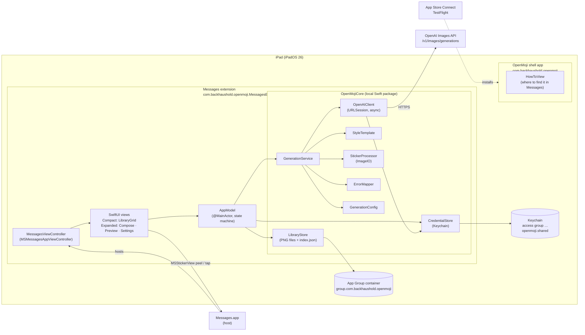

# OpenMoji — Technical Specification

- **Status:** Proposed (M2)
- **Date:** 2026-10-02
- **Source of truth for scope:** [OpenMoji PRD](https://claude.ai/code/artifact/4eb3c358-d044-4b4f-a48b-2aca31cd3bbe) (locked decisions D1–D10, FR-1–24, NFR-1–10, REL-1–9)
- **Decisions:** [docs/adr/](adr/) · **Open questions:** [docs/open-questions.md](open-questions.md)

OpenMoji is an iPad-only iMessage app extension that turns a text prompt into an emoji-style sticker. It calls the OpenAI Images API directly from the device, processes the result into a Messages-compliant PNG, and keeps a per-device library. The repo produces two targets: a minimal shell app and the Messages extension. Releases go to TestFlight internal testers through a local, one-command lane that is reimplemented for OpenMoji using Sagelet's lane as a reference. **Nothing publishes from CI, and no secrets are stored in GitHub.**

---

## 1. Scope, inputs and assumptions

### 1.1 Inputs since the PRD's first draft

| Item | Resolution | Effect on this spec |
|---|---|---|
| OQ-1 presentation context | Messages context (app drawer); media context deferred | `MSSupportedPresentationContexts = [MSMessagesAppPresentationContextMessages]` only |
| OQ-2 device family | **iPad-only** (resolved 2026-10-02) | `TARGETED_DEVICE_FAMILY = 2` on both targets — [ADR-0014](adr/0014-ipad-only-device-family.md) |
| OQ-3 Sagelet pipeline specifics | Read from `backhaushold/sagelet` @ `4ec916b` | Closed by §12 and [ADR-0010](adr/0010-local-release-lane.md) |
| Product name / bundle ID | OpenMoji, `com.backhaushold.openmoji` | App Store Connect record name "OpenMoji Family" (OQ-5, resolved 2026-10-02) |
| Target | iPad Air (4th gen), iPadOS 26.7; deployment target 26.0 (D8) | — |

### 1.2 Corrections to PRD facts (flagged, not reopened)

These do not change any locked decision, but the PRD text should be corrected.

1. **GPT Image 2 is not deprecated.** OpenAI's [deprecations page](https://developers.openai.com/api/docs/deprecations) retires `gpt-image-1-mini`, `gpt-image-1.5` and `chatgpt-image-latest` on 2026-12-01; `gpt-image-2` remains current. Flare stays the default (speed); the model ID stays configurable (FR-9).
2. **NFR-8 ("under ~$0.05 at medium") is unverified.** OpenAI publishes token prices for GPT Image 2.5 ($5/M text in, $8/M image in, $30/M image out — [pricing](https://developers.openai.com/api/docs/pricing)) but no per-image price. The only static figure is GPT Image 2 at 1024² medium = $0.053. 2.5 adds `xhigh` and `max`, so "medium" may sit lower. M1 measures real cost from the response `usage` field.
3. **Apple's 300–618 px range is guidance, not a hard limit, and "square" is not stated.** The [MSSticker initializer](https://developer.apple.com/documentation/messages/mssticker/init(contentsoffileurl:localizeddescription:)) says "must be less than 500 KB" (hard) and "for the best results… 300 x 300 pixels to 618 x 618 pixels" (soft). We still produce square output inside that range.

### 1.3 Assumptions (explicit)

| # | Assumption | If wrong |
|---|---|---|
| A1 | The OpenAI project key is granted **Model capabilities: Request** and **List models: Read** (needed for FR-4 validation, [ADR-0009](adr/0009-key-validation.md)) | FR-4 reports "key lacks permission"; family admin adds the scope |
| A2 | The OpenAI organization is verified for GPT Image 2.5 (confirmed 2026-10-02, OQ-7) | Every generation returns an access error; mapped to "key not permitted" with the API message |
| A3 | Text entry works in the expanded Messages-context view on iPadOS 26 (Apple documents expanded as the place for text input) | Verified in M3 shell build before feature work |
| A4 | `MSStickerView` supports tap-to-insert and peel-and-drag in both compact and expanded styles (docs describe peel-and-drag but not per-style) | Fallback: `activeConversation.insert(_:)` on tap; verified in M3 |
| A5 | `MSSticker` accepts file URLs inside the App Group container | Fallback: copy to the extension's temp dir before creating the sticker; verified in M3 |
| A6 | App Store Connect internal-testing groups can be set to auto-distribute new builds | REL-5 falls back to an explicit API call (§12.5) |
| A7 | The same Apple Distribution certificate (team `AB5S94XWRQ`) used by Sagelet can sign OpenMoji | Create a second distribution cert |

---

## 2. Architecture

The extension owns everything the PRD's bounded context names: prompt, generation, processing, library and credential. All logic lives in a local Swift package (`OpenMojiCore`) so it can be unit-tested with `swift test` on the Mac host, independent of the simulator ([ADR-0001](adr/0001-xcodegen-and-local-package.md)).



**Flow.** `AppModel` drives a small state machine: `needsKey → idle → generating(task) → preview(result) → idle`, with `failed(error, prompt)` returning to `idle` with the prompt intact (PRD core flow). `GenerationService.generate(prompt:)` is one `async throws` call: template → request → decode → process → `ProcessedSticker`. Keep writes to `LibraryStore`; Regenerate repeats `generate` with the same (or edited) prompt.

**Concurrency.** Swift 6 language mode, strict concurrency complete. `AppModel` is `@MainActor`; `OpenAIClient`, `LibraryStore` and `CredentialStore` are actors or `Sendable` structs; `StickerProcessor` is a pure `Sendable` function run off the main actor. Cancel (FR-10) cancels the generation `Task`, which cancels the `URLSession` data task.

**Lifecycle.** Messages may tear down the extension when it leaves the screen. An in-flight generation is simply lost; nothing is persisted until Keep, so FR-24 holds. `willResignActive` cancels any in-flight task.

---

## 3. Targets, modules and entitlements

Project defined in XcodeGen `project.yml`; the `.xcodeproj` is generated and git-ignored ([ADR-0001](adr/0001-xcodegen-and-local-package.md)).

| Target | Type | Bundle ID | Contents |
|---|---|---|---|
| `OpenMoji` | application | `com.backhaushold.openmoji` | One SwiftUI screen explaining where to find OpenMoji in Messages; embeds the extension |
| `OpenMojiMessages` | app-extension (`com.apple.message-payload-provider`) | `com.backhaushold.openmoji.MessagesExtension` | `MessagesViewController`, SwiftUI views, iMessage app icon set |
| `OpenMojiCore` | local Swift package (library) | — | All logic in §2's Core box; depends only on Foundation, ImageIO, UniformTypeIdentifiers, Security, OSLog |
| `OpenMojiCoreTests` | package test target | — | Unit tests (§11) run with `swift test` |
| `OpenMojiMessagesTests` | unit-test bundle (hosted by the app) | — | Keychain round-trip on simulator, view-model tests |

**Shared build settings.** `DEVELOPMENT_TEAM = AB5S94XWRQ`, `IPHONEOS_DEPLOYMENT_TARGET = 26.0`, `TARGETED_DEVICE_FAMILY = 2`, `SWIFT_VERSION = 6.0`, `SWIFT_STRICT_CONCURRENCY = complete`, `GENERATE_INFOPLIST_FILE = YES`, `MARKETING_VERSION` bumped by hand, `CURRENT_PROJECT_VERSION` injected by the release lane (§12.3), `INFOPLIST_KEY_ITSAppUsesNonExemptEncryption = NO` (HTTPS only).

**Extension Info.plist (via `info.properties` in `project.yml`).**

```yaml
NSExtension:
  NSExtensionPointIdentifier: com.apple.message-payload-provider
  NSExtensionPrincipalClass: $(PRODUCT_MODULE_NAME).MessagesViewController
MSSupportedPresentationContexts: [MSMessagesAppPresentationContextMessages]
OpenMojiImageModel: $(OPENMOJI_IMAGE_MODEL)      # FR-9, ADR-0013
OpenMojiImageQuality: $(OPENMOJI_IMAGE_QUALITY)
```

Declaring only the Messages context matters: declaring both contexts puts the extension *only* in the restricted media context ([Apple](https://developer.apple.com/documentation/messages/adding-sticker-packs-and-imessage-apps-to-the-system-stickers-app-messages-camera-and-facetime)).

**Entitlements** (both targets, identical — [ADR-0006](adr/0006-app-group-and-keychain-group.md)):

```xml
<key>com.apple.security.application-groups</key>
<array><string>group.com.backhaushold.openmoji</string></array>
<key>keychain-access-groups</key>
<array><string>$(AppIdentifierPrefix)com.backhaushold.openmoji.shared</string></array>
```

Both App IDs must have the App Groups capability enabled with that group before their App Store profiles are generated (§12.2).

**Privacy manifest.** Both targets ship `PrivacyInfo.xcprivacy` declaring no tracking and no collected data types. Required-reason APIs: none planned (no `UserDefaults`, no file-timestamp APIs; `createdAt` lives in the index). Revisit if that changes.

**Icons.** iPad app icon for the shell; an iMessage App Icon set for the extension (Messages requires its own sizes, including the 1024 × 768 marketing image). A missing icon is an upload rejection, as Sagelet learned with its iPad icon.

---

## 4. Data model

```swift
struct Sticker: Codable, Identifiable, Sendable, Equatable {
    let id: UUID
    let prompt: String          // as typed, ≤ 200 chars (FR-6)
    let createdAt: Date
    let modelID: String         // model that produced it (FR-16)
    let quality: String         // e.g. "medium"
    let pixelSize: Int          // final edge length, 300…618
    let byteCount: Int          // final PNG size, < 500_000
    var fileName: String { "\(id.uuidString).png" }
}

struct LibraryIndex: Codable {
    var schemaVersion: Int      // 1
    var stickers: [Sticker]     // newest first
}
```

**On disk** ([ADR-0005](adr/0005-library-storage-format.md)), under the App Group container:

```
<group>/Library/Application Support/Stickers/
    index.json
    9F1C…E2.png
    …
```

`containerURL(forSecurityApplicationGroupIdentifier:)` creates only `Library/Caches`; `LibraryStore` creates `Application Support/Stickers` on first use. Application Support (not Caches) because the OS may purge Caches and the library must survive restarts (acceptance criterion).

**Write ordering (FR-24).**

- *Keep:* write `<id>.png` with `.atomic` → append to in-memory index → write `index.json` with `.atomic`. A crash between steps leaves an orphan PNG, never a dangling index entry.
- *Delete (FR-19):* remove from index → write `index.json` atomically → delete PNG.
- *Launch:* load index; if missing or undecodable, rebuild an empty index **without deleting PNGs**, log the fault, and keep the corrupt file as `index.corrupt-<timestamp>.json`. Orphan PNGs (on disk, not in index) are left in place in v1.
- A failed generation never touches the store; only Keep writes.

**Accessibility description (FR-15, NFR-2).** Derived at `MSSticker` creation time, not stored: `String(prompt.prefix(150))`, which counts grapheme clusters; Apple's limit is 150 Unicode characters, so truncate by `unicodeScalars` to be safe.

---

## 5. OpenAI request/response contract

Endpoint and client choices: [ADR-0002](adr/0002-images-generations-endpoint.md), [ADR-0003](adr/0003-urlsession-client.md). Verified against [the image generation guide](https://developers.openai.com/api/docs/guides/image-generation) and [the Images API reference](https://developers.openai.com/api/reference/cli/resources/images/index.md) on 2026-10-02.

### 5.1 Request

```http
POST https://api.openai.com/v1/images/generations
Authorization: Bearer <key from Keychain>
Content-Type: application/json
```

```json
{
  "model": "gpt-image-2.5-flare",
  "prompt": "<StyleTemplate.render(userPrompt)>",
  "n": 1,
  "size": "1024x1024",
  "quality": "medium",
  "background": "transparent",
  "output_format": "png",
  "moderation": "auto"
}
```

| Parameter | Value | Why |
|---|---|---|
| `model` | From `GenerationConfig` (Info.plist `OpenMojiImageModel`), default `gpt-image-2.5-flare` | FR-9; the alias, not a dated snapshot (OQ-8, resolved) |
| `n` | `1` | D3, FR-8 |
| `size` | `1024x1024` | Smallest standard square. Custom sizes must total ≥ 655,360 px (≈ 810²), so 618 px cannot be requested directly |
| `quality` | From `GenerationConfig`, default `medium` | FR-9; final default set by M1 (OQ-4) |
| `background` | `transparent` | FR-8, NFR-3; requires `png` or `webp` |
| `output_format` | `png` | Lossless alpha; avoids a WebP decode path. Revisit in M1 if latency matters (jpeg is documented as fastest but has no alpha) |
| `moderation` | `auto` (default, sent explicitly) | Family use; `low` not justified |
| Not sent | `response_format` (unsupported for GPT image models), `partial_images`, `user` | b64 is the only output; no streaming in v1 |

### 5.2 Response

```json
{
  "created": 1790975701,
  "background": "transparent",
  "output_format": "png",
  "quality": "medium",
  "size": "1024x1024",
  "data": [ { "b64_json": "iVBORw0KGgo…" } ],
  "usage": { "input_tokens": 0, "output_tokens": 0, "total_tokens": 0 }
}
```

Decoded fields: `data[0].b64_json` (required). `usage` is decoded as **optional** and only logged in debug builds for the M1 cost measurement. The reference marks it "gpt-image-1 only" while the guide says to use it for 2.5, so nothing depends on it.

### 5.3 Client behaviour

- `URLSessionConfiguration.ephemeral` (no disk cache of prompts or images, no cookies), `timeoutIntervalForRequest = 90`, `timeoutIntervalForResource = 90` (NFR-4).
- No automatic retries. Every attempt costs money (D3, D7); retry is the user's Regenerate.
- The `Authorization` header is set per request from `CredentialStore`. The key is never logged or included in errors (NFR-6).
- The response body is decoded with `JSONDecoder` into a struct whose image field is `String`, then `Data(base64Encoded:)`. Peak is about 2.7 MB base64 plus 2 MB PNG, freed once processing returns.

### 5.4 Key validation (FR-4, [ADR-0009](adr/0009-key-validation.md))

`GET https://api.openai.com/v1/models/{configured model ID}` with the candidate key, before saving.

| Result | Meaning | Save? |
|---|---|---|
| 200 | Key valid and the model is visible | Yes |
| 401 | Invalid key | No — "That key isn't valid." |
| 403 | Missing "List models: Read" permission, or org/region not permitted | No — "That key doesn't have permission. Check its permissions in OpenAI." |
| 404 | Key valid but model not visible (org not verified, or wrong ID) | Yes, with warning: "Key saved, but this account can't use the image model yet." |
| Offline / timeout | Can't check | Offer "Save anyway" |

---

## 6. Error handling and FR-22 mapping

`ErrorMapper` turns transport errors and OpenAI error bodies (`{"error": {"message", "type", "code", "param"}}`, [error codes](https://developers.openai.com/api/docs/guides/error-codes)) into a closed `GenerationError` enum. The UI shows one plain message per case. The prompt is always kept (FR-23) and the library is never touched (FR-24).

| Condition (checked in order) | `GenerationError` | User message (draft) | FR-22 category |
|---|---|---|---|
| `CancellationError` / `URLError.cancelled` | `.cancelled` | none; return to prompt | — |
| `URLError` `.notConnectedToInternet`, `.networkConnectionLost`, `.dataNotAllowed`, `.internationalRoamingOff` | `.offline` | "You're offline. Your stickers still work; making new ones needs internet." | offline |
| `URLError.timedOut` or 90 s elapsed | `.timeout` | "That took too long. Try again." | timeout |
| HTTP 401 | `.invalidKey` | "The OpenAI key isn't working. Check it in Settings." (+ Settings button) | invalid key |
| HTTP 403 | `.keyNotPermitted(apiMessage)` | "This key isn't allowed to make images." + API message | invalid key |
| HTTP 429 and `code` ∈ {`credit_balance_exhausted`, `organization_spend_limit_exceeded`, `project_spend_limit_exceeded`, `organization_usage_limit_exceeded`, `insufficient_quota`} or `type == "insufficient_quota"` | `.budgetExhausted` | "The sticker budget is used up. Ask the family admin to top it up." | budget / quota |
| HTTP 429, any other code (including `rate_limit_exceeded`, `slow_down`) | `.rateLimited(retryAfter:)` | "Too many stickers at once. Try again in N seconds." (`Retry-After` header, else no number) | rate limited |
| HTTP 400 and `code == "moderation_blocked"` or `type == "image_generation_user_error"` | `.contentRefused` | "OpenAI won't make that one. Try wording it differently." | content refused |
| HTTP 404 / `code == "model_not_found"` | `.modelUnavailable(apiMessage)` | "The image model isn't available on this account." + API message | (config; surfaces API message per PRD risk table) |
| HTTP 5xx (including 503 `server_is_overloaded`) | `.serviceUnavailable` | "OpenAI is having trouble. Try again shortly." | — |
| Other HTTP 4xx | `.api(status, apiMessage)` | "Something went wrong: <API message>" | — |
| Missing `b64_json` / bad base64 / ImageIO failure | `.processingFailed` | "Couldn't turn that into a sticker. Try again." | — |

Billing 429s are checked **before** rate-limit 429s because both share the status. The moderation check uses `code` first; the HTTP status for refusals is not documented, so the mapper keys on `type`/`code` regardless of status. All cases log `status`, `type` and `code` with `OSLog`. The prompt is logged `privacy: .private` and the key never.

---

## 7. Sticker processing pipeline (FR-13–15, NFR-1, NFR-5)

[ADR-0004](adr/0004-imageio-thumbnail-pipeline.md). Implemented as a pure function in `OpenMojiCore`:

```swift
func makeSticker(from encoded: Data) throws -> (png: Data, edge: Int)
```

### 7.1 Steps

1. **Source without decode.** `CGImageSourceCreateWithData(encoded, [kCGImageSourceShouldCache: false])`. Never `UIImage(data:)` and never a full-size `CGImage` (NFR-5).
2. **Thumbnail at target edge.** `CGImageSourceCreateThumbnailAtIndex(src, 0, opts)` with
   `kCGImageSourceCreateThumbnailFromImageAlways: true`, `kCGImageSourceThumbnailMaxPixelSize: edge`, `kCGImageSourceCreateThumbnailWithTransform: true`, `kCGImageSourceShouldCacheImmediately: true`. Alpha is preserved because the source PNG carries it and the thumbnail keeps the source's alpha info.
3. **Square guard.** If the result isn't square (it is for a 1024² request), centre it on a transparent `edge × edge` canvas.
4. **Encode.** `CGImageDestinationCreateWithData(…, UTType.png.identifier, 1, nil)`, add the image, finalize.
5. **Size check.** If `png.count < 500_000` → done. Otherwise repeat steps 2–4 **from the original encoded source** at the next edge in `[618, 560, 512, 448, 384, 300]`. Never re-encode a downscaled image, so quality doesn't compound.
6. **Floor.** At 300 px the loop always terminates under the limit. A 300 × 300 RGBA image is 360,000 bytes raw, and PNG's worst case adds only small per-row and zlib overhead (≈ 362 KB), well under 500 KB. If it somehow doesn't fit, throw `.processingFailed` rather than ship an invalid sticker (FR-14 says never below 300).
7. **Alpha sanity (log only).** If `alphaInfo` is `.none` / `.noneSkip*`, log a warning. The sticker is still kept. M1 tells us whether the model ever returns opaque output under `background: transparent`.

### 7.2 Memory budget

| Stage | Live allocation (approx.) |
|---|---|
| Response body (base64 JSON) | ≈ 2.7 MB (for a ≈ 2 MB PNG) |
| Decoded PNG `Data` | ≈ 2 MB |
| Thumbnail bitmap, 618² RGBA | 1.5 MB |
| Encoded output PNG | < 0.5 MB |
| **Peak** | **≈ 7 MB**, versus 4 MB extra for a full 1024² decode, which we avoid |

The response `Data` and decoded source are dropped as soon as `makeSticker` returns. Apple documents no number for the extension memory ceiling, only "significantly lower than a foreground app". M4 verifies peak with Instruments Allocations on the iPad Air: the generation-to-keep path should stay under 30 MB resident above the idle baseline.

**Verification note.** Apple's docs describe `kCGImageSourceThumbnailMaxPixelSize` as bounding the output, not as a guarantee that decoding happens at reduced resolution. The Instruments run is the evidence for NFR-5, not the API's name.

### 7.3 Accessibility description

`MSSticker(contentsOfFileURL: url, localizedDescription: Sticker.accessibilityText)` where the text is the prompt truncated to 150 Unicode scalars (§4).

---

## 8. Keychain design (FR-1–5, NFR-6)

[ADR-0006](adr/0006-app-group-and-keychain-group.md), [ADR-0007](adr/0007-keychain-item-attributes.md).

| Attribute | Value |
|---|---|
| `kSecClass` | `kSecClassGenericPassword` |
| `kSecAttrService` | `com.backhaushold.openmoji.openai` |
| `kSecAttrAccount` | `api-key` |
| `kSecAttrAccessGroup` | `AB5S94XWRQ.com.backhaushold.openmoji.shared` (read at runtime from the entitlement's resolved value) |
| `kSecAttrAccessible` | `kSecAttrAccessibleWhenUnlockedThisDeviceOnly` |
| `kSecAttrSynchronizable` | `false` (FR-2: device-only; `ThisDeviceOnly` forbids sync anyway) |
| `kSecValueData` | UTF-8 key bytes |

**`CredentialStore` API** (protocol, so tests and previews use an in-memory fake):

```swift
protocol CredentialStore: Sendable {
    func load() throws -> String?          // nil = no key (FR-5)
    func save(_ key: String) throws        // SecItemAdd, or SecItemUpdate on errSecDuplicateItem
    func clear() throws                    // SecItemDelete; errSecItemNotFound is success
}
```

- **Access group at runtime.** iOS has no public API to read an entitlement, so `KeychainCredentialStore` asks the Keychain which group an item with no explicit group lands in (the first `keychain-access-groups` entry, already resolved), keeps its prefix and appends `.com.backhaushold.openmoji.shared`. A non-secret probe item (service `com.backhaushold.openmoji.access-group-probe`) is created once for this and left in place.
- **Entry (FR-1).** Settings sheet reachable from the expanded view: one `SecureField`, Save, Clear. Input is trimmed of whitespace and must start with `sk-`; otherwise "That doesn't look like an OpenAI key" (no network call).
- **Validate-then-save (FR-4).** §5.4.
- **Display (FR-3).** After save, the field is replaced by `•••• last4` computed from `load()` at display time. The full key is never placed back into a text field.
- **Routing (FR-5).** On `willBecomeActive`, `AppModel` calls `load()`. If nil: compact shows the library (sending works with no key, NFR-10) plus a "Set up OpenMoji" button. Expanded opens straight to Settings instead of the prompt.
- **Never logged (NFR-6).** `CredentialStore` and `OpenAIClient` have no log statements that touch the key. `GenerationError` cases never carry request headers. A unit test asserts that `String(describing:)` of every error case and of the request-builder output with a sentinel key contains no `sk-`.

---

## 9. Style prompt template (draft for the M1 spike)

FR-7. The user's prompt is inserted verbatim (trimmed, ≤ 200 chars) at `{subject}`. This is a starting point; M1 tunes it against the 20-prompt set.

```text
A single emoji-style sticker of {subject}.
Style: modern flat emoji illustration, bold clean outlines, simple rounded shapes,
bright saturated colors, soft cel shading, glossy highlight, friendly expression where a face applies.
Composition: one subject, centered, filling about 85% of a square canvas, fully in frame, front-facing.
Background: fully transparent. No scene, no ground, no drop shadow, no border, no frame.
No text, letters, numbers, captions or watermarks.
```

**M1 evaluation set (20 prompts).** It covers the axes that break emoji style: faces (`grumpy cat`, `grandma laughing`), objects (`taco`, `rocket`), abstract ideas (`brain freeze`, `monday mood`), text-bait (`happy birthday`, `thank you`), fine detail at risk of alpha halos (`fluffy dog`, `curly hair girl`), multi-subject (`two penguins hugging`), family in-jokes (3 chosen by the family) and edge cases (`a`, a 200-character prompt, emoji-only input `🐸☕️`).

**Scoring per output.**
1. Reads as an emoji at 100 pt.
2. Background fully transparent.
3. No text rendered.
4. Subject centred and uncropped.
5. Edge halo visible on a dark bubble (yes/no).

Pass bar: ≥ 17/20 on items 1–4. Record latency and `usage` for each run at `low`, `medium` and `high` to close OQ-4 and replace NFR-8's estimate.

---

## 10. UI structure

[ADR-0008](adr/0008-swiftui-with-msstickerview.md). `MessagesViewController` hosts one `UIHostingController(rootView: RootView(model:))` and forwards `willTransition(to:)` / `didTransition(to:)` into `AppModel.presentationStyle`.

| Style | Content | FRs |
|---|---|---|
| **Compact** | Library grid (`LazyVGrid` of `StickerCell`, a `UIViewRepresentable` wrapping `MSStickerView`), newest first; "New sticker" button → `requestPresentationStyle(.expanded)`; empty state | FR-17, 18, 20 |
| **Expanded – Compose** | `TextField` (200-char limit with counter), Generate, gear → Settings; library grid below | FR-6, 1 |
| **Expanded – Generating** | Progress indicator, "Making your sticker…", Cancel | FR-10 |
| **Expanded – Preview** | Large `MSStickerView` of the processed PNG (written to a temp file), Keep, Regenerate, editable prompt | FR-11, 12 |
| **Expanded – Error** | Message from §6, prompt intact, Try again | FR-22, 23 |
| **Settings sheet** | §8 | FR-1–5 |
| **Library editing** | Context menu on a cell: Delete (FR-19); "Reuse prompt" (FR-21, *Could*) | FR-19, 21 |

Text entry only happens in expanded. Apple recommends against text fields in compact and says to request expanded as soon as such a control is selected. Tap-to-insert and peel-and-drag come from `MSStickerView` itself (A4). Dynamic Type and VoiceOver labels cover every control, and each sticker cell's label is its description (NFR-9). Library browsing, insert and drag need no network (NFR-10).

---

## 11. Test strategy

| Layer | Runs where | What |
|---|---|---|
| `OpenMojiCoreTests` (`swift test`) | Mac host: CI and the release lane | `StickerProcessor`: fixtures for a 1024² transparent PNG (→ 618 px, < 500 KB, alpha kept), a high-entropy RGBA noise PNG (forces step-down; asserts the edge is in the ladder and ≥ 300), a non-square source (padded square), an opaque source (kept, warning logged), corrupt data (throws). `ErrorMapper`: one canned body per §6 row, including both 429 families and `moderation_blocked`. `OpenAIClient`: a `URLProtocol` stub asserts the method, URL, JSON body fields from §5.1, the `Authorization` header and the 90 s timeouts, and maps the stubbed responses. `LibraryStore`: temp-dir tests for Keep/Delete ordering, newest-first order, a corrupt index (preserved, not deleted), and survival across re-instantiation. `StyleTemplate`: substitution and trimming. Secret hygiene: no `sk-` in any error description. `GenerationConfig`: defaults and Info.plist overrides |
| `OpenMojiMessagesTests` (xcodebuild, simulator) | CI | Real Keychain round-trip in the shared access group; `AppModel` state transitions with fake services (no key → Settings, failure keeps prompt, cancel) |
| [Device checklist](device-checklist.md) (manual) | iPad Air, TestFlight build | The PRD acceptance criteria verbatim, plus A3–A5, Instruments peak memory (§7.2) and a dark-bubble halo check |
| M1 spike | Throwaway script | §9 evaluation |

REL-7 requires the processing and error-mapping tests (first row) to pass before every upload. Because they run with `swift test` on the Mac, the release lane doesn't depend on a working local simulator, which is a known Sagelet pain point.

---

## 12. Release pipeline

[ADR-0010](adr/0010-local-release-lane.md), [ADR-0011](adr/0011-manual-per-target-signing.md), [ADR-0012](adr/0012-secret-scanning-gitleaks.md), [ADR-0015](adr/0015-app-store-connect-api-tooling.md).

OpenMoji's lane is **written from scratch for this repo**. Sagelet (`backhaushold/sagelet` @ `4ec916b`: `scripts/testflight.sh`, `scripts/op-run.sh`, `testflight/ExportOptions.plist`, `docs/runbooks/testflight-release.md`) is a reference for structure and known pitfalls only. No files are copied or shared.

### 12.1 What carries over from Sagelet, and what is new

| Aspect | Sagelet (reference) | OpenMoji |
|---|---|---|
| Entry point | `make testflight` on the owner's Mac | Same shape: `make testflight` (REL-1) |
| Secrets | 1Password via `op run --env-file` | Same model (REL-2), own vault `OpenMoji` and own `release/.env.example` |
| Signing | Manual, Apple Distribution cert in a dedicated, non-auto-locking keychain | Same approach, own `openmoji-signing.keychain-db`; **per-target profiles** (Sagelet's single global profile override would break the extension) |
| ASC auth | ASC API key (.p8 base64 in 1Password), used for export/upload | Same (REL-4): held in 1Password, used only by the local lane; never a GitHub secret or an Apple ID session |
| Build number | `git rev-list --count HEAD` | Same (REL-3) plus a preflight that requires HEAD == `origin/main` so the count is monotonic |
| Upload | `xcodebuild -exportArchive`, `destination=upload` | Same |
| Tests before upload | None | `swift test` for OpenMojiCore (REL-7) |
| CI gate check | None | Preflight requires a green CI run on HEAD |
| Secret scan | None | gitleaks in CI and in the lane (REL-6) |
| Tester distribution | Manual in ASC | Internal group "Family" auto-distribution, verified by API (REL-5) |
| Release notes | None | "What to Test" from `git log` since the last `build-*` tag (REL-8) |
| Expiry | None | Secret-free scheduled GitHub Actions check on the newest `build-*` tag's date opens an issue at ≤ 14 days; `make testflight-status` reads the exact date locally (REL-9) |
| Known pitfalls to design for | Homebrew `rsync` breaks CreateIPA; login keychain → `errSecInternalComponent` in non-interactive sessions; `xcode-select` must point at full Xcode | Lane puts `/usr/bin` first on `PATH`, uses the dedicated keychain, preflights `xcode-select -p` |

### 12.2 One-time setup (runbook, `docs/runbooks/testflight-release.md`, written in M3)

1. Register App IDs `com.backhaushold.openmoji` and `com.backhaushold.openmoji.MessagesExtension`, each with **App Groups** (`group.com.backhaushold.openmoji`). Keychain sharing needs no portal capability; it is the `keychain-access-groups` entitlement under the team prefix.
2. Create App Store distribution profiles **"OpenMoji App Store"** and **"OpenMoji Messages App Store"** and install them.
3. Import the Apple Distribution certificate into `~/Library/Keychains/openmoji-signing.keychain-db`: create the keychain, turn off auto-lock, `security import -T /usr/bin/codesign`, then `set-key-partition-list -S apple-tool:,apple:,codesign:`. Store its password in 1Password.
4. Create the App Store Connect app record (name: "OpenMoji Family"), iPad only, and an internal testing group "Family" with **automatic distribution** on. Add family members as App Store Connect users.
5. Create one App Store Connect API key (App Manager role) and store it in 1Password `op://OpenMoji/testflight-asc-api-key/{issuer-id,key-id,private-key-base64}`. It is never added to GitHub.

### 12.3 `make testflight` sequence (`scripts/release.sh` via `scripts/op-run.sh`)

```text
 0. export PATH="/usr/bin:$PATH"; set -euo pipefail; trap cleanup EXIT
 1. Preflight      clean tree · on main · HEAD == origin/main · CI green on HEAD (gh api check-runs)
                   · xcode-select points at Xcode.app · required env present
 2. Secret scan    gitleaks detect --redact --no-banner            (REL-6)
 3. Generate       xcodegen generate
 4. Tests          swift test --package-path Packages/OpenMojiCore   (REL-7)
 5. Keychain       unlock openmoji-signing keychain, prepend to search list (restored on exit)
 6. Archive        BUILD_NUMBER=$(git rev-list --count HEAD)          (REL-3)
                   xcodebuild archive -scheme OpenMoji -configuration Release
                     -destination generic/platform=iOS
                     CURRENT_PROJECT_VERSION=$BUILD_NUMBER
                     OTHER_CODE_SIGN_FLAGS="--keychain $SIGNING_KEYCHAIN_PATH"
                   (profiles come from project.yml per target — no global PROVISIONING_PROFILE_SPECIFIER)
 6b. Artifact scan  grep -ra -E "sk-[A-Za-z0-9_-]{20,}" over the .xcarchive (binaries included); fail on any hit       (acceptance: no key in build artifacts)
 7. Upload         xcodebuild -exportArchive -exportOptionsPlist release/ExportOptions.plist
                     -authenticationKeyPath <tmp .p8> -authenticationKeyID … -authenticationKeyIssuerID …   (REL-1, REL-4)
 8. Post-upload    scripts/asc.swift wait-for-build $BUILD_NUMBER   (poll until processingState = VALID)
                   scripts/asc.swift set-whats-new $BUILD_NUMBER "$(git log build-<prev>..HEAD --format='- %s')"   (REL-8)
                   scripts/asc.swift ensure-in-group $BUILD_NUMBER "Family"   (REL-5; no-op if auto-distributed)
 9. Tag            git tag -a build-$BUILD_NUMBER -m "TestFlight upload $(date -u +%FT%TZ)"
                   git push origin build-$BUILD_NUMBER    (the annotated tag's date is the upload date that 12.6's expiry check reads)
```

Archives are kept under `build/release/OpenMoji-<N>.xcarchive` for dSYMs. Steps 1–4 fail before anything is signed.

### 12.4 `release/ExportOptions.plist`

| Key | Value |
|---|---|
| `method` | `app-store-connect` |
| `destination` | `upload` |
| `teamID` | `AB5S94XWRQ` |
| `signingStyle` | `manual` |
| `signingCertificate` | `Apple Distribution` |
| `provisioningProfiles` | `com.backhaushold.openmoji` → `OpenMoji App Store`; `com.backhaushold.openmoji.MessagesExtension` → `OpenMoji Messages App Store` |
| `uploadSymbols` | `true` (explicit) |
| `testFlightInternalTestingOnly` | `true` (the build can never go to external testing or review, matching D9) |
| `manageAppVersionAndBuildNumber` | `false` (the lane owns the build number) |

### 12.5 Signing settings in `project.yml` ([ADR-0011](adr/0011-manual-per-target-signing.md))

```yaml
targets:
  OpenMoji:
    settings:
      configs:
        Release:
          CODE_SIGN_STYLE: Manual
          CODE_SIGN_IDENTITY: Apple Distribution
          PROVISIONING_PROFILE_SPECIFIER: OpenMoji App Store
  OpenMojiMessages:
    settings:
      configs:
        Release:
          CODE_SIGN_STYLE: Manual
          CODE_SIGN_IDENTITY: Apple Distribution
          PROVISIONING_PROFILE_SPECIFIER: OpenMoji Messages App Store
```

Debug stays on automatic signing for running on the iPad from Xcode.

### 12.6 CI and expiry automation (GitHub Actions)

GitHub Actions only verifies and alerts. It never signs or uploads, and the repo holds **no Actions secrets**. Workflows use only the built-in, per-run `GITHUB_TOKEN`, with least-privilege `permissions`.

- **`ci.yml`**: on `pull_request` and `push` to `main`, `macos-latest`, `setup-xcode` latest-stable, `permissions: contents: read`.
  1. gitleaks (REL-6).
  2. SwiftFormat and SwiftLint lint.
  3. `shellcheck scripts/*.sh` and `make release-test` (`scripts/test-release.sh`, the lane self-test, which stubs every external tool: no signing, network, 1Password or App Store Connect), so the release lane scripts do not rot. Both run on every event, including docs-only changes (about ten seconds).
  4. `swift test` (OpenMojiCore).
  5. `xcodegen generate`.
  6. `xcodebuild test` for `OpenMojiMessagesTests` on an iPad simulator with `CODE_SIGN_IDENTITY=-` (ad-hoc signing, so the host app carries its keychain entitlement; unsigned builds fail the Keychain test with `errSecMissingEntitlement`).

  CI does not cache DerivedData. A `paths-ignore` for docs-only changes is **not** used, because the lane's preflight needs a check run on every `main` commit. Instead a cheap docs-only fast path skips steps 5–6.
- **`testflight-expiry.yml`** (REL-9, alert only): `schedule: cron "0 14 * * *"` plus `workflow_dispatch` (input `threshold_days`, default 14), `ubuntu-latest`, `permissions: contents: read, issues: write`.
  1. Check out with tags and find the newest `build-*` tag by `creatordate`. The lane creates it as an annotated tag at upload (§12.3 step 9), so its date is the upload date.
  2. Expiry ≈ tag date + 90 days. TestFlight counts from upload; processing adds minutes, which is negligible against a 14-day threshold.
  3. If expiry is ≤ `threshold_days` away and no open issue has the label `testflight-expiry`, open one: "TestFlight build N expires about <date>; run `make testflight` on the release Mac". With no `build-*` tag yet, do nothing.
  4. No App Store Connect access and no stored secrets.
- **`make testflight-status`** (local): `scripts/asc.swift latest-build` reads the newest VALID build's exact `expirationDate` and processing state with the 1Password-held key. Use it to confirm an alert or after an expired or rejected build.
- **Limitation, accepted:** the tag-based check can't see builds uploaded outside the lane or builds that failed processing after the tag was pushed. The lane is the only upload path, and step 8 waits for VALID before step 9 tags, so both cases come down to a failed lane run, which is visible at the time.
- **`scripts/asc.swift`** ([ADR-0015](adr/0015-app-store-connect-api-tooling.md)): a single-file Swift script that signs the ES256 JWT with CryptoKit and calls `GET /v1/builds`, `POST/PATCH /v1/betaBuildLocalizations` (`whatsNew`) and `POST /v1/builds/{id}/relationships/betaGroups`. No Ruby, Python or third-party dependencies. Runs **only on the release Mac**.

---

## 13. Traceability

| ID | Satisfied by | Verified by |
|---|---|---|
| FR-1 | Settings sheet (§8, §10) | Device checklist |
| FR-2 | `CredentialStore`, Keychain attributes (§8), ADR-0007 | Keychain round-trip test (simulator); secret-hygiene test |
| FR-3 | Settings sheet last-4 display, Clear (§8) | `AppModel` tests; device checklist |
| FR-4 | `OpenAIClient.validate` → `GET /v1/models/{id}` (§5.4), ADR-0009 | `OpenAIClient` stub tests (200/401/403/404/offline) |
| FR-5 | `AppModel` routing on `willBecomeActive` (§8) | `AppModel` test; acceptance criterion 1 |
| FR-6 | Compose `TextField`, 200-char limit (§10) | `AppModel` test |
| FR-7 | `StyleTemplate` (§9) | `StyleTemplate` tests; M1 |
| FR-8 | Request body `n:1`, `background:transparent`, `output_format:png` (§5.1) | Request-builder stub test |
| FR-9 | `GenerationConfig` from Info.plist build settings (§3), ADR-0013 | `GenerationConfig` test |
| FR-10 | Generating state + Task cancellation (§2, §10) | `AppModel` cancel test |
| FR-11 | Preview with Keep / Regenerate (§10) | `AppModel` tests |
| FR-12 | Editable prompt in Preview (§10) | `AppModel` test |
| FR-13 | `StickerProcessor` ImageIO thumbnail ≤ 618 px, alpha kept (§7), ADR-0004 | Processor fixture tests |
| FR-14 | PNG step-down ladder 618 → 300, < 500 KB (§7) | Noise-fixture test |
| FR-15 | `Sticker.accessibilityText` (§4, §7.3) | Unit test (150-scalar truncation) |
| FR-16 | `LibraryStore` Keep with prompt, date, model (§4), ADR-0005 | `LibraryStore` tests |
| FR-17 | Library grid, compact and expanded, newest first (§10) | `LibraryStore` order test; device checklist |
| FR-18 | `MSStickerView` cells (§10), ADR-0008 | Device checklist (A4) |
| FR-19 | Context-menu Delete → `LibraryStore.delete` (§4) | `LibraryStore` test |
| FR-20 | Empty state (§10) | Device checklist |
| FR-21 | "Reuse prompt" context action (§10) — *Could* | Device checklist if built |
| FR-22 | `ErrorMapper` table (§6) | `ErrorMapper` tests, one per row |
| FR-23 | Error state keeps prompt (§6, §10) | `AppModel` failure test |
| FR-24 | Keep-only writes, atomic ordering (§4) | `LibraryStore` tests; failure test asserts library unchanged |
| NFR-1 | §7 ladder + PNG | Processor tests; acceptance criterion 3 |
| NFR-2 | §4 truncation | Unit test |
| NFR-3 | §5.1 `background:transparent` + PNG | Request test; M1 |
| NFR-4 | 90 s timeouts (§5.3) | Client test; acceptance criterion 2 |
| NFR-5 | ImageIO thumbnail-from-encoded (§7), memory budget (§7.2) | Instruments on iPad Air |
| NFR-6 | Keychain only; no key in logs or errors (§8); gitleaks (§12) | Secret-hygiene test; gitleaks |
| NFR-7 | Direct to OpenAI only; no SDKs (ADR-0003); privacy manifest (§3) | `Package.resolved` has no dependencies; review |
| NFR-8 | Configurable quality (FR-9); measured in M1 (§9) | M1 report |
| NFR-9 | Dynamic Type, VoiceOver labels (§10) | Device checklist with VoiceOver |
| NFR-10 | Library and send need no network (§8, §10) | Device checklist in airplane mode |
| REL-1 | `make testflight` (§12.3) | Acceptance criterion "one pipeline run" |
| REL-2 | Sagelet-pattern lane, reimplemented (§12.1), ADR-0010 | Review against §12.1 table |
| REL-3 | `git rev-list --count` + main-only preflight (§12.3) | Lane preflight |
| REL-4 | ASC API key from 1Password, local lane only (§12.3) | Lane run; repo has no Actions secrets (`gh secret list` empty) |
| REL-5 | "Family" group auto-distribution + `ensure-in-group` (§12.3) | Lane run |
| REL-6 | gitleaks in CI and lane (§12), ADR-0012 | Seeded-secret test on a throwaway branch |
| REL-7 | `swift test` in lane step 4 (§12.3) | Lane run |
| REL-8 | `set-whats-new` from `git log` (§12.3) | Build visible in TestFlight with notes |
| REL-9 | Secret-free `testflight-expiry.yml` alert from tag dates; `make testflight-status` (§12.6) | `workflow_dispatch` dry run with threshold override |

---

## 14. Open questions

Tracked in [open-questions.md](open-questions.md).
